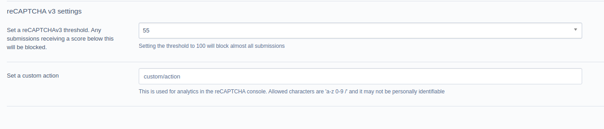

# Silverstripe reCAPTCHA v3 field for userforms

This module provides a [silverstripe/userforms](https://github.com/silverstripe/silverstripe-userforms) reCAPTCHAv3 field with configurable action and score.



## Configuration

All configuration happens in the [nswdpc/silverstripe-recaptcha-v3](https://github.com/nswdpc/silverstripe-recaptcha-v3) module.

Once a field is added to your user form, a score and action can be added to it, or a rule selected.

## Requirements

+ [nswdpc/silverstripe-recaptcha-v3](https://github.com/nswdpc/silverstripe-recaptcha-v3)
+ [silverstripe/userforms](https://github.com/silverstripe/silverstripe-userforms)

See [composer.json](./composer.json) for details

## Installation

```
composer require nswdpc/silverstripe-recaptcha-v3-userforms
```

## License

[BSD-3-Clause](./LICENSE.md)

## Documentation

* [Documentation](./docs/en/001_index.md)

## Bugtracker

We welcome bug reports, pull requests and feature requests on the Github Issue tracker for this project.

Please review the [code of conduct](./code-of-conduct.md) prior to opening a new issue.

## Security

If you have found a security issue with this module, please email digital[@]dpc.nsw.gov.au in the first instance, detailing your findings.

## Development and contribution

If you would like to make contributions to the module please ensure you raise a pull request and discuss with the module maintainers.

Please review the [code of conduct](./code-of-conduct.md) prior to completing a pull request.
